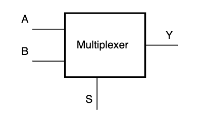
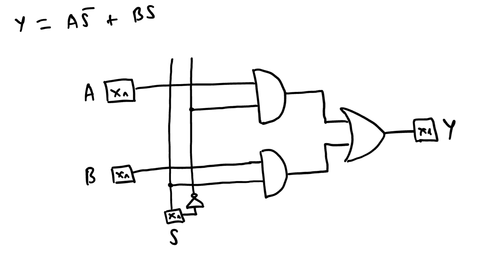
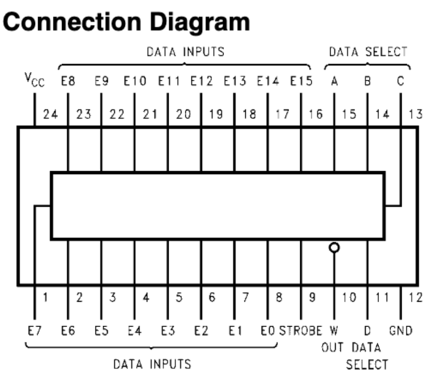
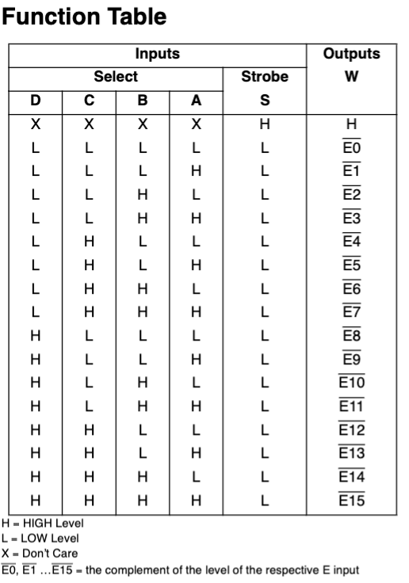
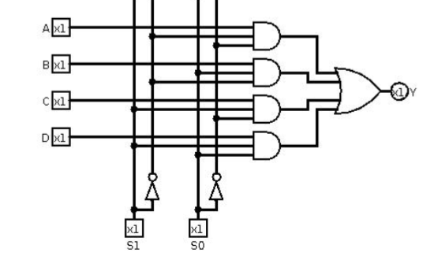
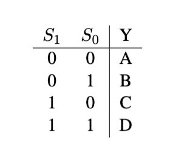
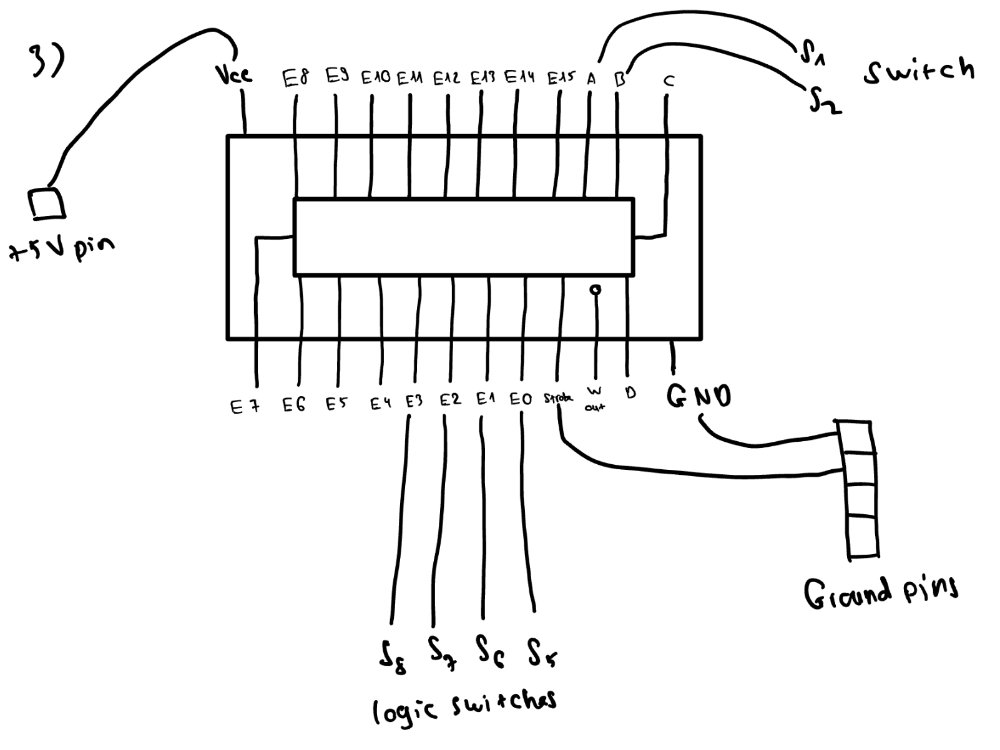
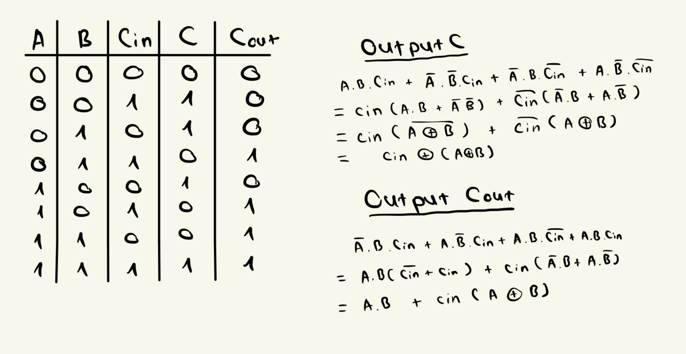
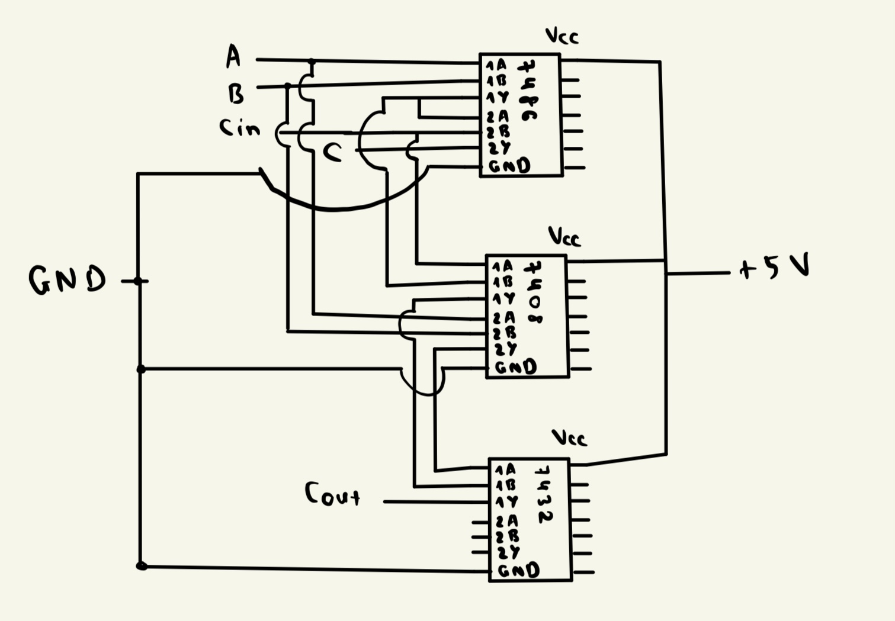

# Lab 01: Journey into Hardware - Digital Design Odyssey

## Overview and Motivation

Welcome to our second lab! In this lab, we delve into the foundations of digital design, focusing on multiplexers and adder circuits. Starting with a 2-to-1 multiplexer constructed from basic logic gates, progressing to a 4-to-1 multiplexer using the 74150 chip, and integrating Arduino for practical testing, we aim to unravel the core principles of digital circuits in an accessible manner. The motivation is to demystify these components, fostering a deep understanding of the binary foundations that power digital technologies. By the end, you'll have hands-on experience with multiplexers, insight into their applications, and a fundamental grasp of how to design and test digital circuits.

## What We Did In The Last Lab

In the previous lab, we familiarized ourselves with the PB-503 breadboard prototyping stations and Arduino microcontroller systems. The activities involved exploring the breadboard's features and integrating the Arduino for embedded processor control. By the end of the lab, you should have mastered working with components like the PB-503 breadboard and its features, LEDs, resistors, integrated circuit chips, requiring reference to IC data sheets, as well as programming the Arduino board and use it to automate the testing process with the breadboard. For more in-depth lab details, refer to the previous lab in this [URL](https://github.com/mlcourses/lab-1-blog-post-group5_cs281/blob/main/post.md)

## Lab Objectives

1. Understand how Multiplexers work.

1. 2-to-1 Multiplexer construction.

2. Implement a 4-to-1 Multiplexer with the 74150 chip.

3. Arduino Testing for 4-to-1 Multiplexer.

4. Desgin and Build a 1-bit Adder Circuit.

## Materials

- PB-503 breadboard prototyping station

- Arduino microcontroller kit

- 7404 NOT gate IC

- 7408 AND gate IC

- 7432 OR gate IC

- 7486 XOR gate IC

- 74150 MUX chip


- IC data sheets

- Wires and connection tools

- Logic Probe

- Arduino IDE software

- Laptop or device for programming and connecting to the Arduino

## Project Steps

### UNDERSTANDING A MULTIPLEXER

- A multiplexer, often called a "MUX", is a sophisticated selector crucial for managing signals in digital systems. Imagine it as a control panel with various input buttons (data inputs), and the multiplexer acts as the conductor, choosing which specific signal gets transmitted to the output.

- Here's the key: input lines carry actual data signals, while the selector lines control which input takes the spotlight. This distinction between control and data is fundamental when it comes to Integrated Circuits (ICs).

- Multiplexers vary in size, accommodating different numbers of inputs in powers of 2. The number of selector lines is log2(n), where n is the number of data inputs. So, for example, a mux with 2 inputs will have 1 select line and one with 4 inputs will have 2 select lines.

- We name the mux by the number of data lines. So we can have common sizes such as 2-to-1, 4-to-1, 8-to-1, 16-to-1 muxes.

### BUILDING A 2 TO 1 MUX

- Here is an outline of what a 2 to 1 mux might look like: 



- In this first section of the lab, we are to build a 2 to 1 multiplexer using the 7408 AND, 7432 OR, and 7404 NOT gate. 

- Before we delve into the wiring portion, we can draw a logical outline for the mux based on its Boolean expression:



- When S (select line) is low (off), it selects line A for the output Y . When S is high, then the output Y copies input B


- Above is the wiring design of our 2 to 1 mux. with the 7408 AND gate IC top left, the 7404 OR gate IC on the bottom and the 7432 OR gate IC on the right. 

- Notice that instead of using 2 separate 7408 AND gate IC, we decided to use just 1 IC and opt for 2 independent small AND gates in the IC, each with 2 inputs and 1 output to reduce the wiring complexity of our digital design. 

- Relating to the logic outline of the mux, we use our PB-503 breadboard's S5 and S6 logical switches as our 2 data input lines, representing A and B while the 7404 NOT gate IC takes switch S1 as our select line. 

### BUILDING A 4 TO 1 MUX

#### 1. Getting To Know The 74150 Chip

- In this 4 to 1 multiplexer circuit, we are only using the 74150 chip as the logic for our multiplexer. Below is the connection diagram and the function table of the chip:





- The `W out` pin is the output of the chip. 

- The `strobe pin` is used to enable/disable the operation of the multiplexer. In this case, if it receives a Ground Voltage, then the multiplexer will be enabled or produce multiple outputs. If it receives a +5 Voltage, the multiplexer will be disabled, only outputting a +5 voltage regardless of what the select input lines are.

#### 2. Wiring The Circuit

- Below is a logical outline for the mux based on its Boolean expression and its truth table:





- Based on the logic circuit above and the structure of the 74150 chip, we can construct a wiring circuit:



- Notice we are having 2 select lines C, D that are not connected to anything, which might cause incorrect outputs. Our solution is that we connect those pins with a Ground connection.

- Here is the actual wiring circuit: 


### AUTOMATE TESTING FOR A 4 TO 1 MUX WITH ARDUINO

- In this part of the lab, we'll use an Arduino to test our 4-to-1 multiplexer instead of manual switches. The Arduino will control the inputs (data and control lines), read the mux output, and perform various tests to confirm the correct operation of both the mux and our circuit.

#### 1. Programming The Arduino

- Below is the program for our Arduino test:

```C++
const int S0[] = {0,0,1,1,0,0,1,1};
const int S1[] = {0,0,0,0,1,1,1,1};
const int A[] = {0,1,0,0,0,0,0,0};
const int B[] = {0,0,0,1,0,0,0,0};
const int C[] = {0,0,0,0,0,1,0,0};
const int D[] = {0,0,0,0,0,0,0,1};
//const int Y[] = {0,1,0,1,0,1,0,1};
// You are probably using a 74150, so the outputs are reversed.
// Use this Y instead:
const int Y[] = {1,0,1,0,1,0,1,0};
const int WAIT0 = 300;
const int WAIT1 = 2000;
int index = 0;
int x; // for reading input
void setup() {
    // Serial Port setup for communication back to computer
    Serial.begin(9600);
    // data pins are outputs (for Arduino)
    pinMode(10,OUTPUT); // A
    pinMode(11,OUTPUT); // B
    pinMode(12,OUTPUT); // C
    pinMode(13,OUTPUT); // D
    // select pins are outputs (for Arduino)
    pinMode(8,OUTPUT); // S0

    pinMode(9,OUTPUT); // S1
    // Mux output is input for Arduino
    pinMode(7,INPUT);
}
void loop() {
    // write data inputs to MUX
    digitalWrite(10,A[index]);
    digitalWrite(11,B[index]);
    digitalWrite(12,C[index]);
    digitalWrite(13,D[index]);
    // write select line inputs to MUX
    digitalWrite(8,S0[index]);
    digitalWrite(9,S1[index]);
    delay(WAIT0); // give time for logic signal to propagate
    // read the MUX output
    x = digitalRead(7);
    // display the results
    Serial.print(index);
    Serial.print(" x:");
    Serial.print(x,BIN);
    Serial.print(", y:");
    Serial.print(Y[index],BIN);
    Serial.print("\t ");
    if ( x == Y[index] )
    {
    Serial.print(": OK\n");
    }
    else
    {
    Serial.print(": BAD\n");
    }
    delay(WAIT1);
    index = (index+1) % 8; // increment index
}
```

- Lets delve into the logic of our Arduino program. 

- The code runs a series of tests, iterating through different combinations of input values and select lines. It verifies if the output (read by the Arduino) matches the expected output `Y`. The program uses `delay` functions to allow time for the logic signals to propagate and then displays the results on the serial monitor. If the output matches the expected value, it prints "OK"; otherwise, it prints "BAD." 

- The code continuously cycles through the test scenarios in a loop, providing a systematic way to check the multiplexer's correct operation. 

- Additionally, referring to the declaration of the test outputs `Y[]`, we can see that the outputs should be in reversed order compared to the original one which is commented out. We can use the 74150 chip's function table to explain the output being the complement of one of the data inputs. For example, if input to the `E0` pin is 1, then the output when all select input lines are 0 is 0.

#### 2. Integrating the Arduino With Our 4 To 1 MUX

- For consistency, we assigned the following digital pins on the Arduino for specific purposes:

1. Pin 10: Data input A (`E0` on the mux)

2. Pin 11: Data input B (`E1` on the mux)

3. Pin 12: Data input C (`E2` on the mux)

4. Pin 13: Data input D (`E3` on the mux)

5. Pin 8: Select Line 0 (`A` on the mux)

6. Pin 9: Select Line 1 (`B` on the mux)

7. Pin 7: Output data from mux (`W out` on the mux)

- We also have to connect the GND pin adjacent to Pin 13 on the Arduino to the ground on the breadboard. This ensures a common ground reference. It's important to note that we won't use the +5V/GND pins on the power side to power up the Arduino, as it will remain connected to the laptop via the USB cable throughout the experiment.

- Once we verify and compile the program, we can proceed to open the Serial Monitor of the Arduino IDE. If it prints out lines `OK` instead of `BAD`, then we can be sure that the circuit is behaving correctly with the outputs matching our expectation. 

- Below is the wiring circuit when connected to the Arduino: 


### Adder Circuit

#### 1. Understand the Adder Circuit:

- In binary arithmetic, each column functions as a "one-bit adder." Consider two binary numbers, A and B, with respective bits Ai and Bi. The addition process introduces a third input, cin, signifying a carry-over from the preceding column. Consequently, two outputs emerge – the sum bit, Si, and the carry-out bit, cout, potentially influencing the subsequent column in the sequence.

#### 2. Implementing the Adder Circuit:

- To implement it, we can follow the steps below:

1. **Truth Table**: Craft a truth table with inputs A, B, and cin, and outputs C and cout. Populate it based on binary addition logic.

2. **Boolean Equations**: Derive boolean equations for both outputs from the truth table using SOP design principle (refer to this [URL](https://faculty.etsu.edu/tarnoff/ntes2150/Ch6_v02.pdf))

3. **Simplify Equations**: If possible, simplify your boolean expressions to enhance clarity. 



4. **Wiring Diagram**: Construct a wiring diagram for your adder, reusing gate outputs to optimize the circuit. 



5. **Implement the Circuit**: Based on the wiring diagram constructed, implement the circuit on the PB-503 breadboard. 

- Here is the actual wiring design of the circuit when testing with the 0 + 0 addition operation: 


- See testing part for different outputs corresponding to each diffrent inputs.


## Testing

During the first demo we tested our 2 to 1 multiplexer. We noticed that if the selector (s) was off or low(0), the ouout would be input A and if the output was on or high(1) the output would be B. Since this is a 2 to 1 mux there were on the options of A or B. (A if S = 0 or B if s = 1).

During the second demo we tested our 4 to 1 multiplexer. As the title suggest there are 4 inputs: A,B,C,D and 2 selectors: S0 and S1.We noticed that if both of the selectors where low(0), the output would be input A. If S0 was high(1) and S1 was low(0), the output would be input B. if S0 was low(0) and S1 was high(1), the output would be input C. Finally, if both S0 and S1 where high(1), the out put would be input D.

During the third demo we used the Arduino rather than manual switches like we did in demo #2. Since we used a 74150 our outputs where reversed, so we had to use Y instead of X. As you can see from the image below, the program printed out "OK" if the expected output x = (Y[index]) passsed the test and "BAD" if it didn't pass the test.

During the fourth demo we tested our Adder circuit. 

## Conclusion

In wrapping up this lab, we've delved into the intricate world of multiplexers, adder circuits, and digital design. From constructing a 2-to-1 mux with basic gates to utilizing a 74150 chip for a 4-to-1 mux, we've expanded our understanding of these fundamental components. Integrating Arduino into the mix not only showcased practical applications but also emphasized the dynamic nature of digital systems. As we delved into the design and implementation of a 1-bit adder circuit, the lab offered a holistic experience in digital circuitry. The challenges and successes encountered in building, testing, and troubleshooting these circuits provided invaluable insights into the nuances of hardware design. Overall, this lab has laid a solid foundation for comprehending multiplexers, adders, and the broader landscape of digital design in computer systems.


